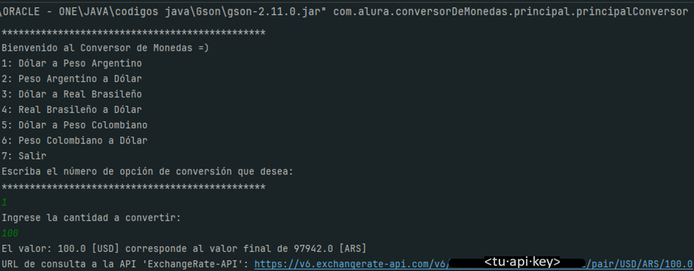
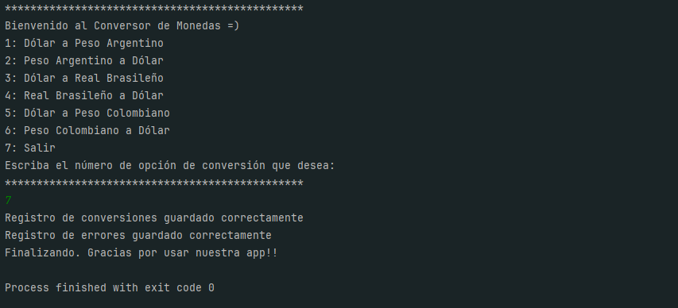
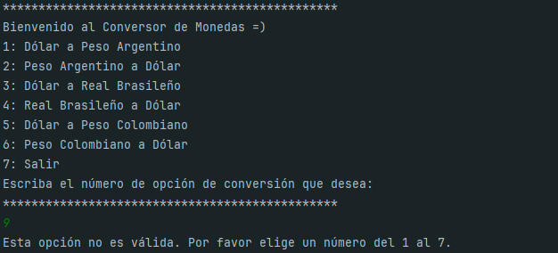
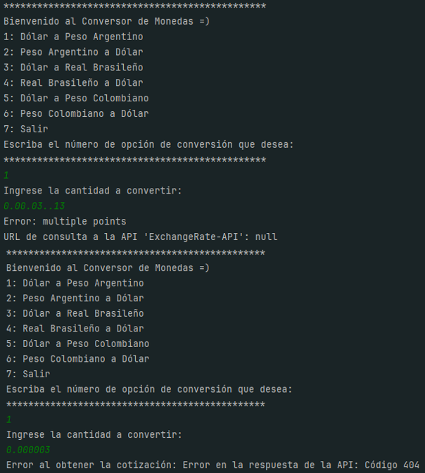
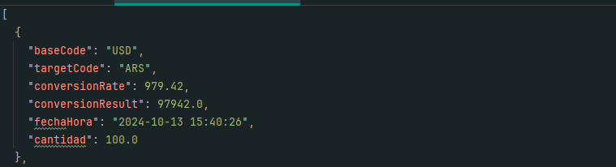
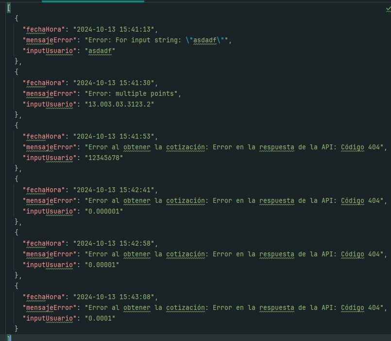

# Conversor de Monedas

## Descripción General

#### Este proyecto es un conversor de monedas que permite a los usuarios convertir entre varias divisas utilizando una API externa para obtener las tasas de conversión. El sistema maneja tanto las conversiones exitosas como los errores que puedan surgir durante el proceso, guardando los resultados y errores en archivos JSON.

### Funcionalidades Principales

- Conversión de varias divisas mediante una API externa.
- Almacenamiento de registros de conversiones y errores en archivos JSON.
- Manejo de errores con descripciones detalladas.
- Soporte para las siguientes divisas:

    - Dólar estadounidense (USD)
    - Peso argentino (ARS)
    - Real brasileño (BRL)
    - Peso colombiano (COP)


### Resumen General del Código

El programa consta de los siguientes archivos:

    ApiClient: Maneja la comunicación con la API de tasas de cambio.
    FileManager: Se encarga de registrar las conversiones y los errores en archivos JSON.
    ConversionModel: Representa el modelo de conversión de monedas.
    ErrorModel: Representa el modelo de manejo de errores.
    PrincipalConversor: Contiene el método principal que interactúa con el usuario.
    ConversorService: Contiene la lógica de conversión y coordina la interacción entre las otras clases.

## Requisitos de Configuración

### API Key
Para el correcto funcionamiento del proyecto, es necesario configurar una API key para realizar solicitudes a la API de ExchangeRate.


Crea un archivo `.env` en el directorio raíz del proyecto con el siguiente contenido:
``APIKEY=<tu api key>``

### Dependencias
Este proyecto requiere las siguientes bibliotecas externas:

- [Gson](https://mvnrepository.com/artifact/com.google.code.gson/gson): Para manejar la conversión entre JSON y objetos Java.
- [Java-Dotenv](https://github.com/cdimascio/java-dotenv): Para cargar variables de entorno desde un archivo `.env`.

Si estás usando Maven o Gradle, asegúrate de que estas dependencias estén correctamente configuradas en tu archivo `pom.xml` o `build.gradle`.
De lo contrario deberás agregarlas manualmente.
---


## Estructura del Proyecto

### 1. ApiClient.java
Esta clase es responsable de la comunicación con la API de tasas de cambio. Se encarga de construir las URL necesarias para la conversión y de obtener las tasas desde la API.

Para este caso utilizamos la API free de https://www.exchangerate-api.com/ 

Esta clase es importada por `ConversorService` y `principalConversor`.

#### Funciones Principales:

- **_resultadoOpcionCliente_(String opcionCliente):** Determina el par de monedas en función de la selección del usuario.

- **_getCotizacionByOpcion_(String resultadoOpcionCliente, String cantidadCliente):** Llama a la API para obtener la tasa de conversión y el resultado de la conversión para una cantidad específica.

Código:
````java
package com.alura.conversorDeMonedas.api;


import java.io.IOException;
import java.net.URI;
import java.net.http.HttpClient;
import java.net.http.HttpRequest;
import java.net.http.HttpResponse;

import com.google.gson.JsonObject;
import com.google.gson.JsonParser;

import io.github.cdimascio.dotenv.Dotenv; // Importa la biblioteca dotenv

public class ApiClient {
    private static final String BASE_URL;
    private final HttpClient client;
    private String lastUsedUrl;

    // Cargar dotenv
    static {
        Dotenv dotenv = Dotenv.load();
        String apiKey = dotenv.get("APIKEY"); // Cargar la APIKEY desde el archivo .env
        BASE_URL = "https://v6.exchangerate-api.com/v6/" + apiKey + "/pair/";
    }

    public ApiClient() {
        this.client = HttpClient.newHttpClient();
    }

    public String resultadoOpcionCliente(String opcionCliente) {
        switch (opcionCliente) {
            case "1": return "USD/ARS/";
            case "2": return "ARS/USD/";
            case "3": return "USD/BRL/";
            case "4": return "BRL/USD/";
            case "5": return "USD/COP/";
            case "6": return "COP/USD/";
            case "7": return "salir";
            default: throw new IllegalArgumentException("Opción no válida. Por favor elige un número del 1 al 7.");
        }
    }

    // Clase auxiliar para retornar tanto el rate como el resultado
    public static class ConversionResponse {
        private final double conversionRate;
        private final double conversionResult;

        public ConversionResponse(double conversionRate, double conversionResult) {
            this.conversionRate = conversionRate;
            this.conversionResult = conversionResult;
        }

        public double getConversionRate() {
            return conversionRate;
        }

        public double getConversionResult() {
            return conversionResult;
        }
    }

    // Método para obtener conversion_rate y conversion_result de la API
    public ConversionResponse getCotizacionByOpcion(String resultadoOpcionCliente, String cantidadCliente) throws IOException, InterruptedException {
        String url = BASE_URL + resultadoOpcionCliente + cantidadCliente;
        lastUsedUrl = url;

        HttpRequest request = HttpRequest.newBuilder()
                .uri(URI.create(url))
                .build();

        HttpResponse<String> response = client.send(request, HttpResponse.BodyHandlers.ofString());

        if (response.statusCode() == 200) {
            JsonObject jsonResponse = JsonParser.parseString(response.body()).getAsJsonObject();
            double conversionRate = jsonResponse.get("conversion_rate").getAsDouble(); // Obtener la tasa de conversión
            double conversionResult = jsonResponse.get("conversion_result").getAsDouble(); // Obtener el resultado de la conversión
            return new ConversionResponse(conversionRate, conversionResult); // Retornar ambos valores
        } else {
            throw new IOException("Error en la respuesta de la API: Código " + response.statusCode());
        }
    }

    public String getLastUsedUrl() {
        return lastUsedUrl;
    }
}

```` 


### 2. FileManager.java

Clase responsable de manejar los registros de conversiones y errores, almacenando ambos en archivos JSON.
Importa a las clases `ConversionModel` y `ErrorModel`,
y es importada por `ConversorService` y `principalConversor`.

#### Funciones Principales:

- **_addRegistro_(ConversionModel registro)**: Agrega un registro de conversión.

- **_addError_(ErrorModel error)**: Agrega un error.

- **_writeToJson_(String filename)**: Escribe los registros en un archivo JSON.

- **_writeErrorsToJson_(String filename)**: Escribe los errores en un archivo JSON.

Código:

````java
package com.alura.conversorDeMonedas.io;

import com.alura.conversorDeMonedas.modelos.ConversionModel;
import com.alura.conversorDeMonedas.modelos.ErrorModel;
import com.google.gson.Gson;
import com.google.gson.GsonBuilder;

import java.io.FileWriter;
import java.io.IOException;
import java.util.ArrayList;
import java.util.List;

public class FileManager {
    private List<ConversionModel> registros = new ArrayList<>();  // Lista para ConversionModel
    private List<ErrorModel> errores = new ArrayList<>(); // Lista para ErrorModel

    // Método para agregar un registro de conversión
    public void addRegistro(ConversionModel registro) {
        registros.add(registro);
    }

    // Método para agregar un registro de error
    public void addError(ErrorModel error) {
        errores.add(error); // Agregar ErrorModel a la lista de errores
    }

    // Método para escribir registros de conversiones en JSON
    public void writeToJson(String filename) throws IOException {
        Gson gson = new GsonBuilder().setPrettyPrinting().create(); // Usar Gson para formatear JSON
        try (FileWriter writer = new FileWriter(filename)) {
            writer.write(gson.toJson(registros)); // Guardar lista de ConversionModel como JSON
        }
    }

    // Método para escribir errores en JSON
    public void writeErrorsToJson(String filename) throws IOException {
        Gson gson = new GsonBuilder().setPrettyPrinting().create(); // Usar Gson para formatear JSON
        try (FileWriter writer = new FileWriter(filename)) {
            writer.write(gson.toJson(errores)); // Guardar lista de ErrorModel como JSON
        }
    }
}

````


### 3. ConversionModel.java

Esta clase representa el modelo de conversión de monedas. Almacena la información sobre las monedas involucradas, la tasa de conversión, el resultado, la cantidad ingresada y la fecha y hora de la conversión.

Esta clase es importada por `ConversorService`, `principalConversor` y `FileManager`.

Código:
````java
package com.alura.conversorDeMonedas.modelos;

public class ConversionModel {
    private String baseCode;
    private String targetCode;
    private double conversionRate;
    private double conversionResult;
    private String fechaHora; // Fecha y hora de la consulta
    private double cantidad; // Cantidad ingresada por el cliente

    // Constructor de inicialización de los atributos de la clase
    public ConversionModel(String baseCode, String targetCode, double conversionRate, double conversionResult, String fechaHora, double cantidad) {
        this.baseCode = baseCode;
        this.targetCode = targetCode;
        this.conversionRate = conversionRate;
        this.conversionResult = conversionResult;
        this.fechaHora = fechaHora;
        this.cantidad = cantidad;
    }

    // Getters
    public String getBaseCode() {
        return baseCode;
    }

    public String getTargetCode() {
        return targetCode;
    }

    public double getConversionRate() {
        return conversionRate;
    }

    public double getConversionResult() {
        return conversionResult;
    }

    public String getFechaHora() {
        return fechaHora;
    }

    public double getCantidad() {
        return cantidad;
    }
}

````

### 4. ErrorModel.java

Esta clase es importada por `principalConversor` y `FileManager`.

Código: 

````java
package com.alura.conversorDeMonedas.modelos;

public class ErrorModel {
    private String fechaHora; // Fecha y hora del error
    private String mensajeError; // Mensaje descriptivo del error
    private String inputUsuario; // El valor ingresado por el usuario (opcional)

    // Constructor
    public ErrorModel(String fechaHora, String mensajeError, String inputUsuario) {
        this.fechaHora = fechaHora;
        this.mensajeError = mensajeError;
        this.inputUsuario = inputUsuario;
    }

    // Getters
    public String getFechaHora() {
        return fechaHora;
    }

    public String getMensajeError() {
        return mensajeError;
    }

    public String getInputUsuario() {
        return inputUsuario;
    }
}

````

### 5. ConversorService.java
Clase que contiene la lógica de conversión, obteniendo las tasas de cambio desde `ApiClient` y guardando los resultados a través de `FileManager`.

Ejecuta la conversion importando `ConversionModel`.

Es importada como clase por `principalConversor`.

Código:

````java
package com.alura.conversorDeMonedas.services;

import com.alura.conversorDeMonedas.api.ApiClient;
import com.alura.conversorDeMonedas.io.FileManager;
import com.alura.conversorDeMonedas.modelos.ConversionModel;

import java.io.IOException;

public class ConversorService {
    private final ApiClient apiClient;
    private final FileManager fileManager;

    public ConversorService(ApiClient apiClient, FileManager fileManager) {
        this.apiClient = apiClient;
        this.fileManager = fileManager;
    }

    // Método para realizar la conversión usando los valores obtenidos de la API
    public ConversionModel realizarConversion(String opcionCliente, double cantidad, String fechaHora) throws IOException, InterruptedException {
        String resultadoOpcionCliente = apiClient.resultadoOpcionCliente(opcionCliente);

        // Obtener los valores de la API: conversion_rate y conversion_result
        ApiClient.ConversionResponse conversionResponse = apiClient.getCotizacionByOpcion(resultadoOpcionCliente, String.valueOf(cantidad));

        String baseCode = resultadoOpcionCliente.split("/")[0];
        String targetCode = resultadoOpcionCliente.split("/")[1];

        // Crear el modelo de conversión con los valores obtenidos de la API
        ConversionModel conversion = new ConversionModel(
                baseCode,
                targetCode,
                conversionResponse.getConversionRate(), // Usar la tasa de conversión de la API
                conversionResponse.getConversionResult(), // Usar el resultado de la conversión de la API
                fechaHora,
                cantidad
        );

        // Agregar el registro al FileManager
        fileManager.addRegistro(conversion);

        return conversion;
    }
}

````


### 6. PrincipalConversor.java
Esta clase contiene el método main y es el punto de entrada del programa. Controla la interacción con el usuario y llama a los servicios para realizar las conversiones y manejar errores.

Importa a todas las otras clases. 

Código:

````java
package com.alura.conversorDeMonedas.principal;

import com.alura.conversorDeMonedas.api.ApiClient;
import com.alura.conversorDeMonedas.io.FileManager;
import com.alura.conversorDeMonedas.services.ConversorService;
import com.alura.conversorDeMonedas.modelos.ConversionModel;
import com.alura.conversorDeMonedas.modelos.ErrorModel;

import java.io.IOException;
import java.time.LocalDateTime;
import java.time.format.DateTimeFormatter;
import java.util.Scanner;

public class principalConversor {
    public static void main(String[] args) {
        ApiClient apiClient = new ApiClient();
        FileManager fileManager = new FileManager();
        ConversorService conversorService = new ConversorService(apiClient, fileManager);
        Scanner scanner = new Scanner(System.in);

        DateTimeFormatter dtf = DateTimeFormatter.ofPattern("yyyy-MM-dd HH:mm:ss");

        while (true) {
            System.out.println("***********************************************");
            System.out.println("Bienvenido al Conversor de Monedas =)");
            System.out.println("1: Dólar a Peso Argentino");
            System.out.println("2: Peso Argentino a Dólar");
            System.out.println("3: Dólar a Real Brasileño");
            System.out.println("4: Real Brasileño a Dólar");
            System.out.println("5: Dólar a Peso Colombiano");
            System.out.println("6: Peso Colombiano a Dólar");
            System.out.println("7: Salir");
            System.out.println("Escriba el número de opción de conversión que desea:");
            System.out.println("***********************************************");

            String opcion = scanner.nextLine();

            // Verificar si el usuario desea salir antes de pedir cantidad
            if (opcion.equals("7")) {
                try {
                    fileManager.writeToJson("registroConversiones.json");
                    System.out.println("Registro de conversiones guardado correctamente");
                } catch (IOException e) {
                    System.out.println("Error al guardar el registro de conversiones: " + e.getMessage());
                }
                try {
                    fileManager.writeErrorsToJson("erroresConversion.json");
                    System.out.println("Registro de errores guardado correctamente");
                } catch (IOException e) {
                    System.out.println("Error al guardar el registro de errores: " + e.getMessage());
                }
                System.out.println("Finalizando. Gracias por usar nuestra app!!");
                break;
            }

            // Verificar si la opción es válida
            if (!opcion.matches("[1-6]")) {
                System.out.println("Esta opción no es válida. Por favor elige un número del 1 al 7.");
                continue; // Volver a mostrar el menú
            }

            System.out.println("Ingrese la cantidad a convertir:");
            String cantidadCliente = scanner.nextLine();

            try {
                // Ejecutar la conversión
                double cantidad = Double.parseDouble(cantidadCliente);
                ConversionModel conversion = conversorService.realizarConversion(opcion, cantidad, dtf.format(LocalDateTime.now()));
                System.out.println("El valor: " + cantidad + " [" + conversion.getBaseCode() + "] corresponde al valor final de " + conversion.getConversionResult() + " [" + conversion.getTargetCode() + "]");

            } catch (IllegalArgumentException e) {
                String errorMsg = "Error: " + e.getMessage();
                System.out.println(errorMsg);

                // Crear y registrar ErrorModel
                ErrorModel error = new ErrorModel(dtf.format(LocalDateTime.now()), errorMsg, cantidadCliente);
                fileManager.addError(error);

            } catch (IOException | InterruptedException e) {
                String errorMsg = "Error al obtener la cotización: " + e.getMessage();
                System.out.println(errorMsg);

                // Crear y registrar ErrorModel
                ErrorModel error = new ErrorModel(dtf.format(LocalDateTime.now()), errorMsg, cantidadCliente);
                fileManager.addError(error);

            } catch (Exception e) {
                String errorMsg = "Error: La cantidad ingresada no es válida.";
                System.out.println(errorMsg);

                // Crear y registrar ErrorModel
                ErrorModel error = new ErrorModel(dtf.format(LocalDateTime.now()), errorMsg, cantidadCliente);
                fileManager.addError(error);
            }

            System.out.println("URL de consulta a la API 'ExchangeRate-API': " + apiClient.getLastUsedUrl());
        }
        scanner.close();
    }
}

````

## Ejecución del Proyecto

Ejecuta el proyecto desde `principalConversor.java`.

Selecciona la opción correspondiente a las  divisas que deseas convertir y proporciona la cantidad.

El resultado de la conversión se mostrará en la consola, y las conversiones y errores se guardarán en archivos JSON.


### Ejemplos de ejecución:

#### Ejemplo de resultado:



#### Ejemplo de finalización:



#### Ejemplo de error en opción:



#### Ejemplo de error en cantidad:



#### Ejemplo de archivo registroConversiones.json:



#### Ejemplo de archivo erroresConversion.json:




***************


\
Este proyecto fue desarrollado para el  Challenges Alura "Challenge  Conversor de monedas" de la formación "Java Orientado a Objetos G7 - ONE" de ORACLE NEXT EDUCACTION -

#### `GECR 2024`
```